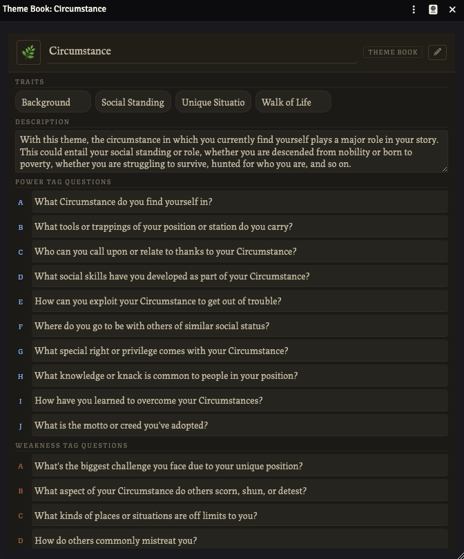
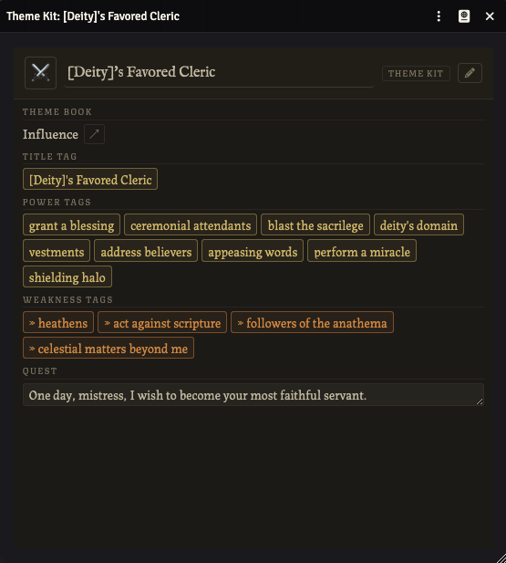
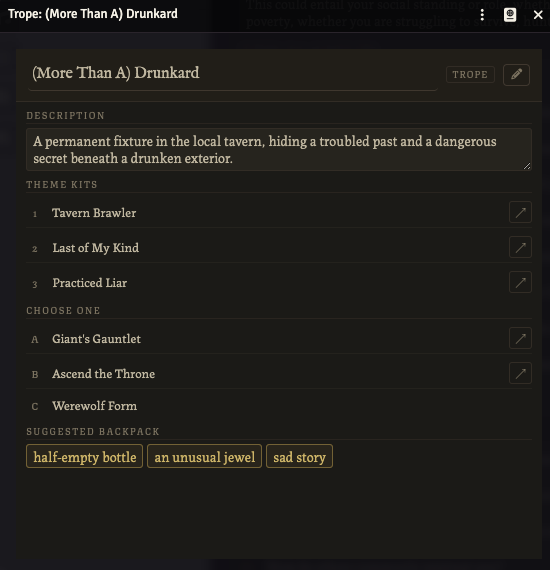
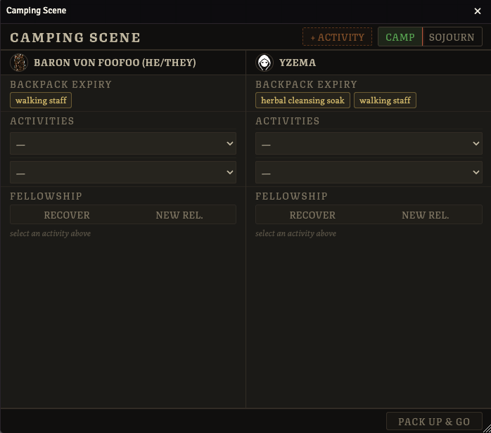
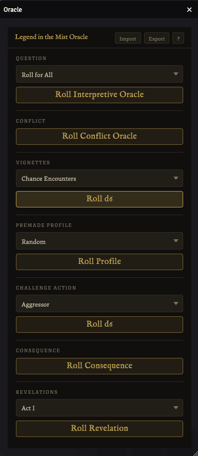

# Legend in the Mist: Unofficial Community Edition

A community-made [FoundryVTT](https://foundryvtt.com) system for [Legend in the Mist](https://www.legendinthemist.com) by Son of Oak Game Studio.

---

## Features

### Hero Sheet

Open a Hero actor from the **Actors** sidebar. The sheet has three columns: relationships, Promise track, and Quintessences on the left; theme cards in the scrollable centre; and statuses, story tags, backpack, and fellowship tags on the right.

Click the pencil icon in the header to toggle edit mode. When edit mode is off the sheet is locked against accidental changes.

**Tags** are pill-shaped buttons. Click the border of a tag to scratch or unscratch it. The text inside is always editable. Right-click any tag, status, backpack item, or relationship for a context menu with options to edit, scratch, or remove it.

**Statuses** have a name field and a row of tier boxes. Click the boxes to fill them. You can type something like `wounded-2` into the name field to set the name and pre-fill the tier in one step. The small minus button reduces the tier by one and removes the status if it hits zero.

**Fellowship** is linked by pasting the Fellowship actor's ID into the Fellowship ID field in the hero card. Once linked the fellowship tags and quest are visible in the right column.

**Rolling** is done from the roll bar at the top of the sheet. See the Roll Panel section below.


---

### Challenge Sheet

Open a Challenge actor from the **Actors** sidebar. The GM can toggle edit mode with the pencil icon. Players see a read-only view.

Tags, limits, statuses, threats, and consequences are all editable inline. Description fields support a shorthand syntax for embedding tag and status pills directly in text. See the **Input Reference** banner at the bottom of the sheet for the full syntax.

The GM can import a challenge from a JSON file by clicking the **import** icon (arrow into a box) in the sheet header. The file can contain a single challenge object or an array of objects to create multiple challenges at once. Each imported sheet opens automatically. Download `assets/challenge-template.json` for the expected format.

Bare status references in consequence and special feature text (e.g. `grabbed-3`) are automatically wrapped as `[grabbed-3]` on import so they render as status pills.


---

### Fellowship Sheet

Open a Fellowship actor from the **Actors** sidebar. To connect it to a Hero, copy the Fellowship actor's ID and paste it into the **Fellowship ID** field on that hero's sheet. Any changes made on the Fellowship sheet are reflected live on all linked hero sheets.

The title tag, power tags, weakness tags, quest, AIM track, and special improvements are all editable directly on this sheet.


---

### Roll Panel

The roll panel opens from the roll bar at the top of any Hero sheet. Click **Quick**, **Detailed**, **Reaction**, or **Sacrifice** to open the panel for that roll type. Click the active button again to close it.

Click tag pills to add them to your roll. Click again to remove. Right click to burn it. Use the **+** and **-** buttons to add a flat modifier. Use the **Might** row to apply a Might comparison result. On Detailed rolls the **Throw Caution** and **Hedge Risks** buttons appear when the conditions for each are met.

When you submit, a chat card is posted with the dice result, all invoked tags, and the outcome.


---

### Scene Tracker

Open from the **Legend in the Mist** canvas controls (scroll icon) or via `LitmSceneTracker.open()` in a macro. This is a GM tool.

Toggle between **Prep** and **Live** in the header. Prep mode is invisible to players. In Live mode you can control what players see using the eye icon next to each item.

Click **+ Add** to create story tags or statuses. Edit names inline. Click a tag border to scratch it. Click **+ Link challenge** to attach a Challenge actor to the scene.

When a player opens the roll panel the tracker automatically enters roll mode. While in roll mode, click any tag or status in the tracker to contribute it to the active player's roll. Each click cycles through positive, negative, and unselected.


---

### Theme Books

Create a Theme Book item from the **Items** sidebar. Click the pencil icon to enter edit mode.

In edit mode you can add and remove traits, power tag questions, weakness tag questions, and quest ideas. The might icon in the header cycles through the three might types: origin (🌿), adventure (⚔️), and greatness (👑). Special improvements can also be added here to describe what heroes unlock as the theme advances.



---

### Theme Kits

Create a Theme Kit item from the **Items** sidebar. Click the pencil icon to enter edit mode.

Use the Theme Book dropdown to link the kit to a theme book. Once linked the book name appears as a subtitle and the ↗ button opens it. The title tag, power tags, weakness tags, and quest are all editable inline.

To apply a kit to a hero, click **Apply Kit** on any theme card of the hero sheet. A dialog opens where you can select a kit and click the tags you want to include. Only the tags you select get added to the theme.



---

### Tropes

Create a Trope item from the **Items** sidebar. Click the pencil icon to enter edit mode.

Use the dropdowns to assign theme kits to the three preset slots and up to three choice slots. The ↗ button next to any filled slot opens that kit directly. Add backpack item suggestions in the Backpack section.

To apply a trope to a hero, click **Apply Trope** on the hero sheet. A dialog shows all the kits in the trope. Pick one kit from the choice group, click the tags you want to include from each kit, and select any backpack items to carry over. Selected backpack items are added directly to the hero's backpack.



---

### Camping Scene

Open from the **Legend in the Mist** canvas controls (campfire icon) or via `LitmCampingScene.open()` in a macro. Opening the scene broadcasts it to all connected players. This is a GM tool.

Use the **Camp** and **Sojourn** buttons in the header to set the scene type. The GM can add a third activity period with the **+ Activity** button.

Each hero column has sections for activities, backpack expiry, and fellowship. Use the activity dropdowns to set what each hero is doing for each period. Checking a backpack item marks it for removal when the scene ends. The fellowship section lets you choose to recover a scratched tag or create a new relationship.

Click **Pack Up & Go** to apply all changes to the hero sheets and post a summary to chat.



---

### Party Overview

Open from the **Legend in the Mist** canvas controls (people icon) or via `LitmPartyOverview.open()` in a macro. Available to all players.

Each hero is shown as a card with their portrait, name, trope, weakness tags, quests, and statuses. Click a card to open that hero's sheet. The GM can remove a hero by hovering the card and clicking the x, and add them back by dragging their actor from the **Actors** sidebar.


---

### Oracle

Open from the **Legend in the Mist** canvas controls (crystal ball icon) or via `LitmOracle.open()` in a macro. Available to all players; Import/Export controls are GM-only.

The oracle panel shows all seven oracles in a single scrollable list. Oracle data is not bundled with the system. The GM imports it from a JSON file. Click **Import** in the header to load a JSON file into the world. Click **Export** to download the current data back out, or **?** to download the blank template showing the expected format.

The **Question** oracle has a dropdown to control what gets rolled: Roll for All rolls each column independently (Symbol & Interpretation share one roll; detail columns each roll separately), All uses a single roll across every column, or you can target a single column. The **Conflict** oracle rolls one independent D66 per column and posts all results together; entries that read "Roll again twice" are expanded automatically and grouped under the same column header.

The **Vignettes**, **Challenge Action**, and **Premade Profile** oracles each have a dropdown to select a category before rolling. Vignettes and Challenge Action roll D6 within the selected category. Premade Profile can also be left on Random to roll D66 for the category first, then resolves each sub-column (Creatures, Persons & People, Places & Events) with its own D6. The **Consequence** oracle rolls D66 for the category then D6 for the specific entry. The **Revelations** oracle has a dropdown to select the current act before rolling D66.



---

## Installation

### From the Foundry module browser (recommended)
1. Open Foundry VTT and go to **Game Systems**
2. Click **Install System**
3. Paste the manifest URL into the **Manifest URL** field:
   ```
   https://raw.githubusercontent.com/coreyhickson/legend-in-the-mist-foundry/main/system.json
   ```
4. Click **Install**

### Manual installation
1. Download the latest release zip from the [releases page](https://github.com/coreyhickson/legend-in-the-mist-foundry/releases)
2. Extract it into your Foundry `Data/systems/` folder so the path is `Data/systems/legend-in-the-mist-foundry/`
3. Restart Foundry

---

## Compatibility

| Foundry version | Status |
|---|---|
| v13 | Verified |

---

## Development

The system uses [Dart Sass](https://sass-lang.com/dart-sass/) to compile styles. Node.js is required.

```bash
npm install        # install dependencies
npm run build      # compile SCSS once
npm run watch      # watch and recompile on changes
```

---

## Contributing

Bug reports and pull requests are welcome on [GitHub](https://github.com/coreyhickson/legend-in-the-mist-foundry).

---

## License

See [LICENSE](LICENSE).

---

## Acknowledgements

*Legend in the Mist* is created by Son of Oak Game Studio. This is a fan-made implementation and is not affiliated with or endorsed by the original creators. Please support the official game.

Thanks to MrTheBino and aMediocreDad for their work on the other Legend in the Mist Foundry systems, they inspired me to make my own :)
