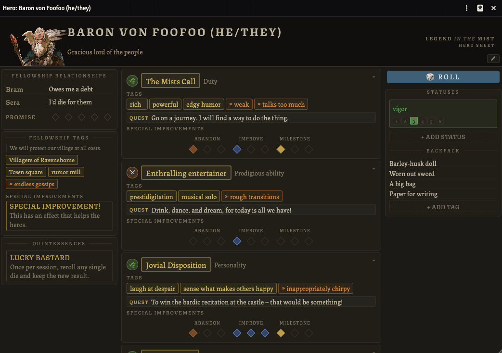
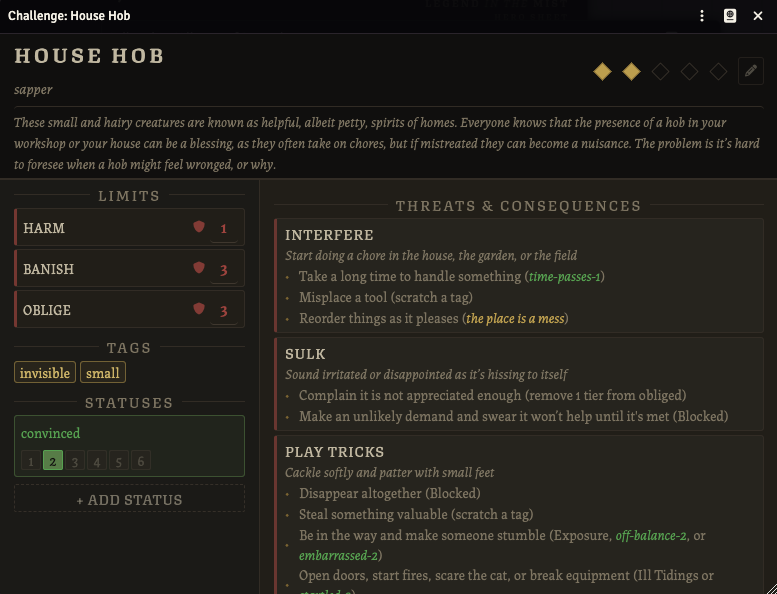
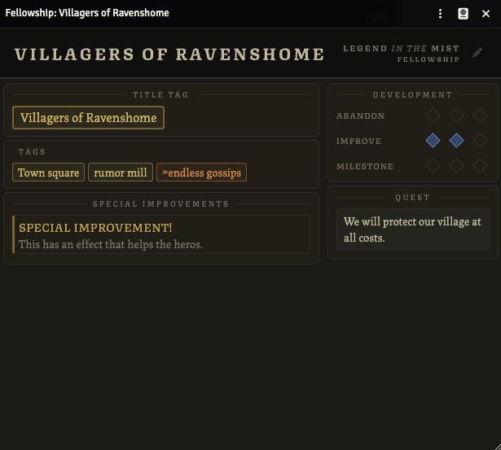
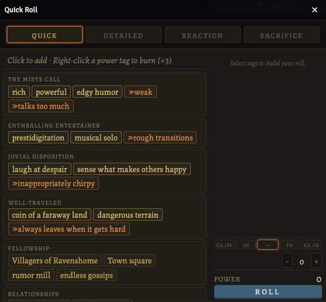
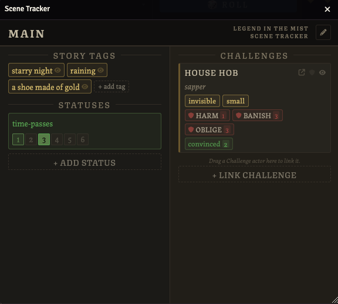
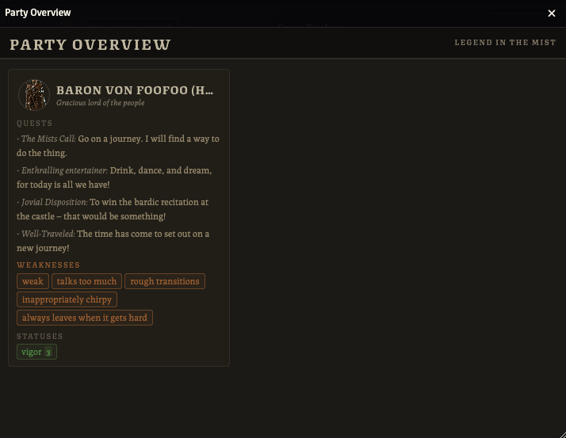

# Legend in the Mist — FoundryVTT System

An unofficial [FoundryVTT](https://foundryvtt.com) implementation of [Legend in the Mist](https://www.legendinthemist.com).

---

## Features

### Hero Sheet

Open a Hero actor from the **Actors** sidebar to see the full sheet. The sheet is split into three columns:

- **Left** — Fellowship relationships, Promise track, and Quintessences
- **Centre** — Four theme cards (name, Might selector, power tags, weakness tags, quest, AIM track, and special improvements), scrollable
- **Right** — Statuses, story tags, backpack, and fellowship tags

**Edit mode** is on by default. Click the pencil icon in the header to toggle it off and lock the sheet against accidental edits. In view mode, tags and inputs are visible but not interactive.

**Tags** — Click the border or padding of a tag pill to scratch/unscratch it. The input inside the pill is always visible; edit it directly. Clearing a power or weakness tag input removes it.

**Statuses** — Type a name and click tier boxes to fill them. Type `wounded-2` to auto-set the name to "wounded" with tier 2 selected. Unchecking all boxes removes the status.

**Fellowship** — Set a Fellowship actor ID in the hero card to link it. The fellowship's tags and quest appear in the right column and are editable from the Fellowship sheet.



---

### Challenge Sheet

Open a Challenge actor from the **Actors** sidebar. The sheet has two columns:

- **Left** — Tags, limits, and special features
- **Right** — Statuses, threats, and consequences

The GM can use the pencil icon to toggle edit mode. In view mode the sheet is read-only for players.

**Inline syntax** — In any description field you can write `[tag name]` to render a tag pill, `[status-N]` for a status pill, or `{limit name}` for a limit reference. An **Input Reference** banner at the bottom of the sheet shows the syntax at a glance.

**Limits** — Each limit has a name, a max value, and tier boxes. Leaving the max blank marks the limit as an immunity ("Immune to: name"). Progress limits show a special feature card that triggers when the limit is maxed.



---

### Fellowship Sheet

Open a Fellowship actor from the **Actors** sidebar. Link it to a Hero by entering the Fellowship actor's ID into the **Fellowship ID** field on the Hero sheet.

- Edit the title tag, power tags, weakness tags, and quest directly on this sheet
- The AIM track (Abandon / Improve / Milestone) works the same as on theme cards — click the current filled dot to reset to 0
- Special improvements can be added and removed in edit mode

Changes to the fellowship are reflected live on any linked hero sheets.



---

### Roll Panel

The roll panel opens from the **roll bar** at the top of any Hero sheet. Click **Quick**, **Detailed**, **Reaction**, or **Sacrifice** to open the panel for that roll type; clicking the active button again closes it.

**Building a roll**
- Click a tag pill in the left column to add it to your roll. Click it again to remove it.
- Right-click a power tag to **burn** it for +3 (the tag is scratched after the roll).
- Weakness tags are always negative and automatically mark Improve on their theme.
- Use the **±** buttons to apply any flat bonus or penalty (e.g. a GM-granted bonus).
- Use the **Might** row (Ex.Im / Im / — / Fa / Ex.Fa) to apply Imperiled or Favored modifiers from a Might comparison. The selected level appears as a named entry in the tally.

**Trade Power** (Detailed rolls only) — Two buttons appear below the tally when rolling Detailed:
- **Throw Caution** — available when Power ≤ 2. Reduces the roll by 1 but increases spending power on a success by 1.
- **Hedge Risks** — available when Power ≥ 2. Increases the roll by 1 but reduces spending power on a success by 1.
The selection is cleared automatically if the power changes and the condition no longer applies.

**Sacrifice rolls** — Select a sacrifice level (Painful, Scarring, or Grave) before rolling. Tags are shown for reference only and do not contribute to power. The GM can still apply a bonus with ±. Outcomes are **Miracle** (10+), **Fate** (7–9), or **In Vain** (6−).

When the roll is submitted a **chat card** is posted showing all invoked tags, the dice result, power total, and outcome. Detailed success cards include a spend-power reference panel.



---

### Scene Tracker

The Scene Tracker is a GM tool. Open it from the **Legend in the Mist** button group in the left-side canvas controls (the scroll icon), or call `LitmSceneTracker.open()` from a macro.

**Prep / Live mode** — Toggle in the header. In **Prep** mode the tracker is invisible to players. Switch to **Live** to make it visible; individual tags, statuses, and challenge cards can be shown or hidden per-item using the eye icon.

**Story tags and statuses** — Click **+ Add** to create a new entry. Edit names inline. Click a tag's border to scratch it. Click the eye icon to toggle player visibility. Click × to remove.

**Challenges** — Click **+ Link challenge** to attach a Challenge actor to the scene. The card shows its role badges, rating, tags, and statuses. Click the arrow icon to open the full challenge sheet. Click × to unlink (the actor is not deleted).

**Roll mode** — When a player opens the roll panel, the tracker enters roll mode automatically. A banner shows the active hero's name and roll type. Click any tag, status, or challenge tag/status to contribute it to the roll — each click cycles through unselected → negative → positive → unselected. Contributions appear in the player's tally in real time.



---

### Party Overview

The Party Overview is accessible to all players. Open it from the **Legend in the Mist** button group in the left-side canvas controls (the people icon), or call `LitmPartyOverview.open()` from a macro.

Each hero appears as a card showing their portrait, name, trope, weakness tags, quests (including fellowship quest), and statuses. Click a card to open that hero's sheet.

**Managing the party** — The GM can remove heroes from the overview by hovering a card and clicking the × button that appears. Drag a Hero actor from the **Actors** sidebar onto the overview to add them back. Heroes added to the world after a removal is made are automatically included.



---

## Installation

### From the Foundry module browser (recommended)
1. Open Foundry VTT and go to **Game Systems**
2. Click **Install System**
3. Paste the manifest URL into the **Manifest URL** field:
   ```
   https://raw.githubusercontent.com/coreyhickson/legend-in-the-mist-foundry/main/system.json
   ```
4. Click **Install**

### Manual installation
1. Download the latest release zip from the [releases page](https://github.com/coreyhickson/legend-in-the-mist-foundry/releases)
2. Extract it into your Foundry `Data/systems/` folder so the path is `Data/systems/legend-in-the-mist-foundry/`
3. Restart Foundry

---

## Compatibility

| Foundry version | Status |
|---|---|
| v13 | ✅ Verified |

---

## Development

The system uses [Dart Sass](https://sass-lang.com/dart-sass/) to compile styles. Node.js is required.

```bash
npm install        # install dependencies
npm run build      # compile SCSS once
npm run watch      # watch and recompile on changes
```

---

## Contributing

Bug reports and pull requests are welcome on [GitHub](https://github.com/coreyhickson/legend-in-the-mist-foundry).

---

## License

See [LICENSE](LICENSE).

---

## Acknowledgements

*Legend in the Mist* is created by Son of Oak Game Studio. This project is a fan-made implementation and is not affiliated with or endorsed by the original creators. Please support the official game.

Thanks to the other Legend in the Mist Foundry system developers, MrTheBino and aMediocreDad, for their work on the other Legend in the Mist systems! These systems helped inspire me to create my own :)
